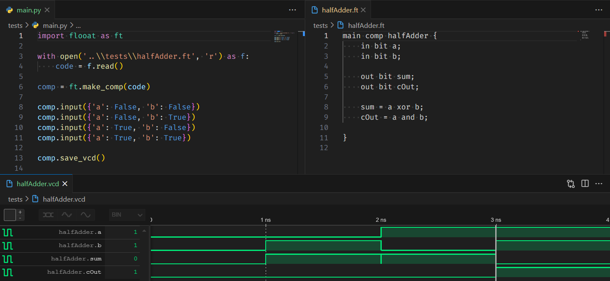

# Flooat

## Introduction

Flooat is a hardware description language and python framework for simulation. It is designed to be **friendly, simple, light and productive**. More easy to use and learn than Verilog and VHDL. Using Flooat, you can create integrated circuits component by using it's HDL or Python framework (or both) that work by the HLS (High Level Synthesis) concept.

## Warning

Flooat is in development and is not ready for production.

## To Do List

- [X] Make the simulator class
- [X] Make EBNF for the language
- [X] Make Scanner
- [X] Make Parser
- [X] Make Builder
- [X] Make accept expressions
- [X] Improve the algorithm of simulation
- [X] Improve structure
- [ ] Improve declaration and assignment
- [ ] Create waveform class
- [ ] Improve Semantic Analysis
- [ ] Add multi-bit signals support
- [ ] Add multi-bit signals addressing support
- [ ] Add sub-components support
- [ ] Add Python calls support
- [ ] Improve HLS support
- [ ] Add manual time control
- [ ] Add others file types support for waveforms
